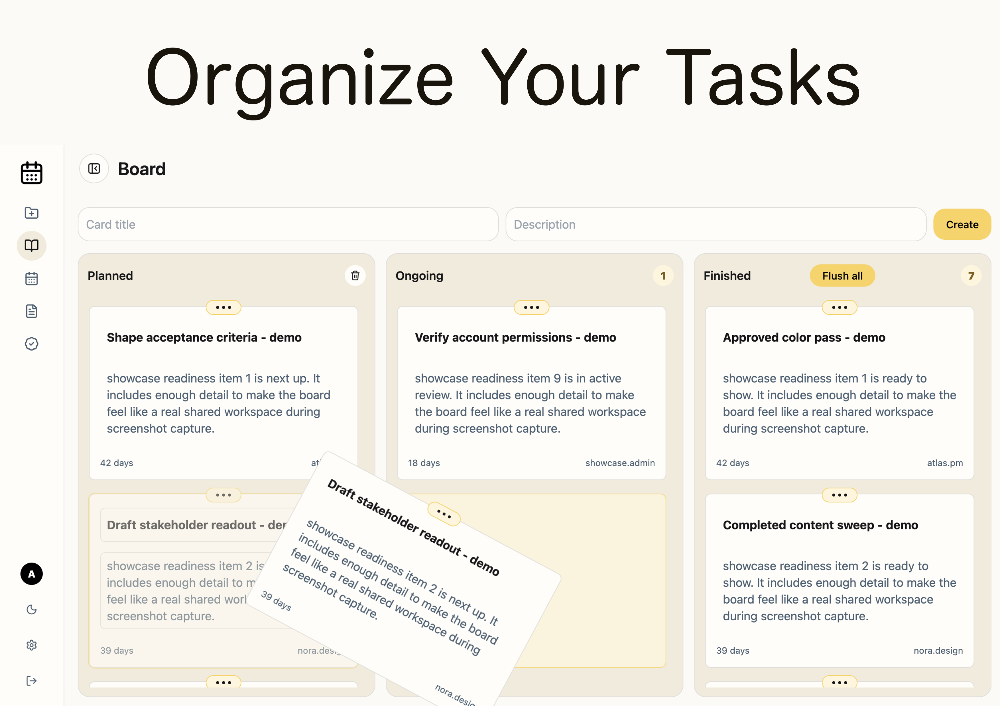
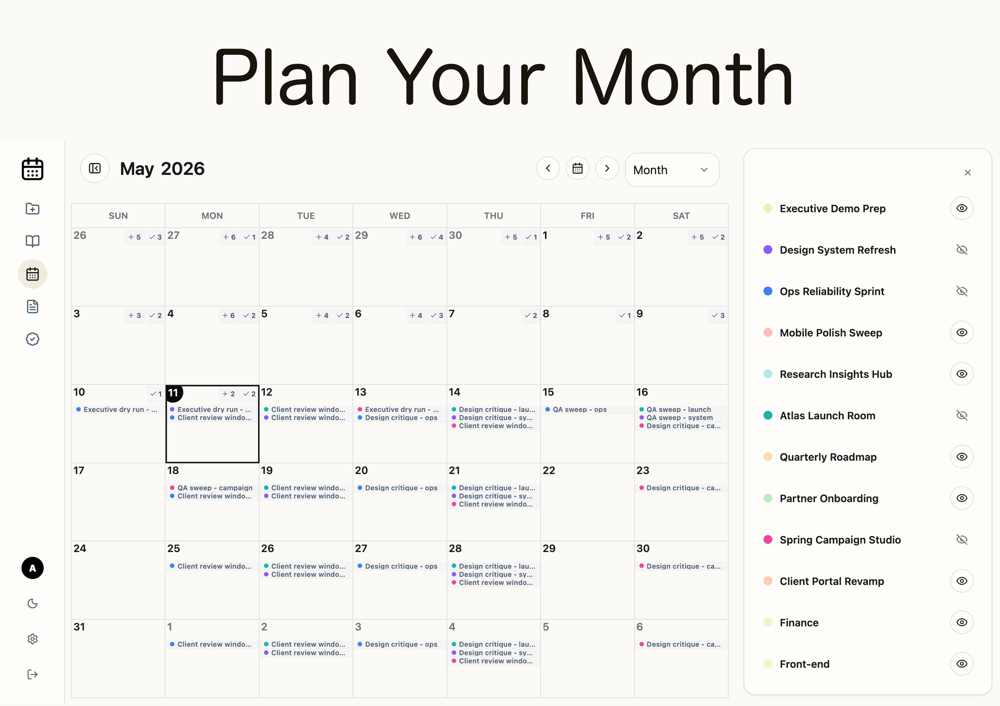
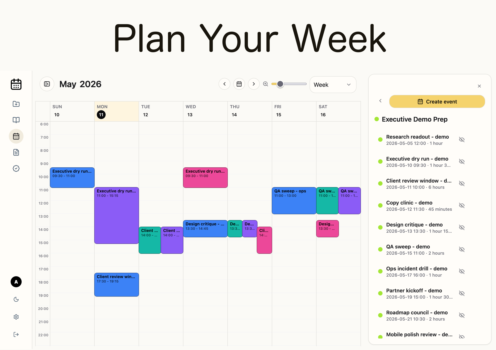
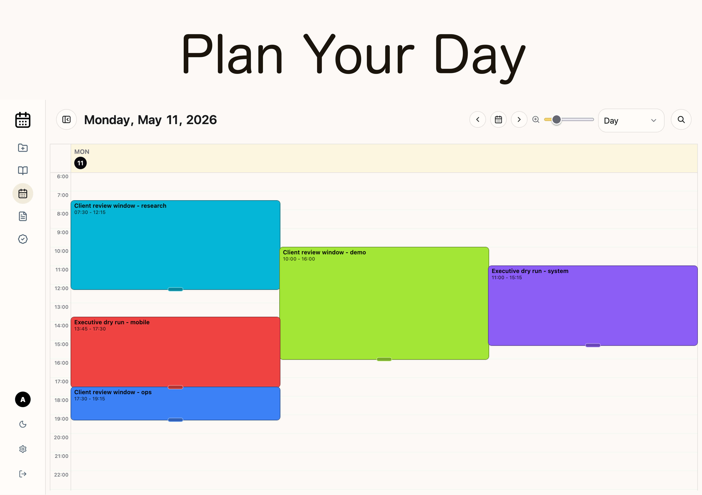
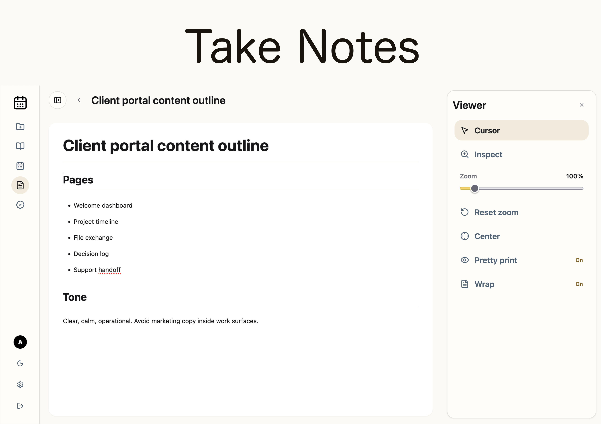
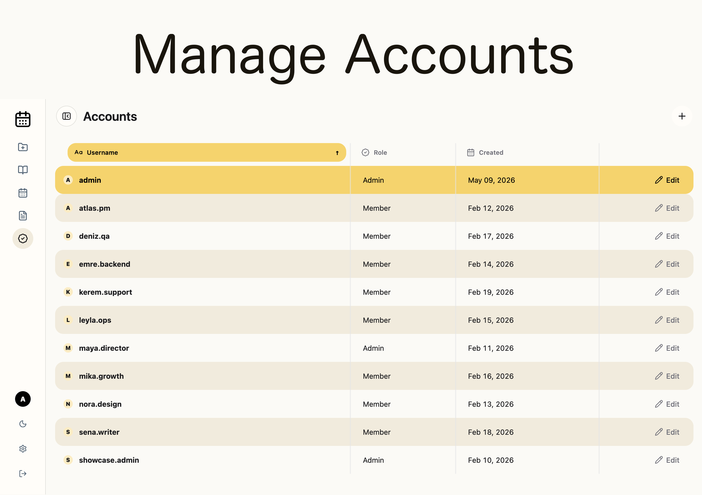
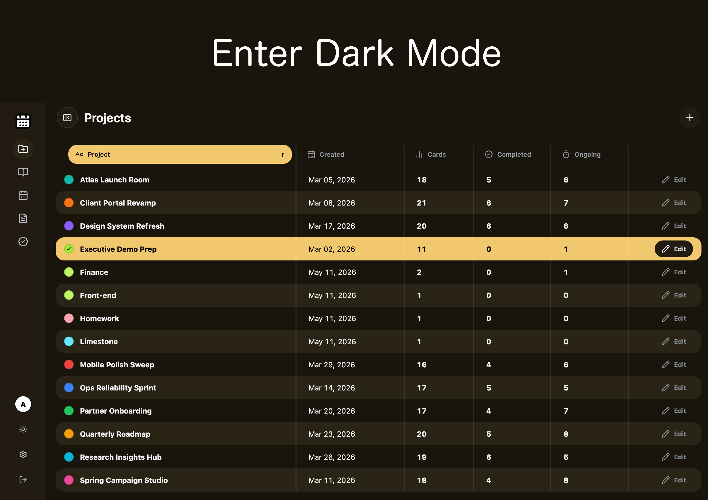
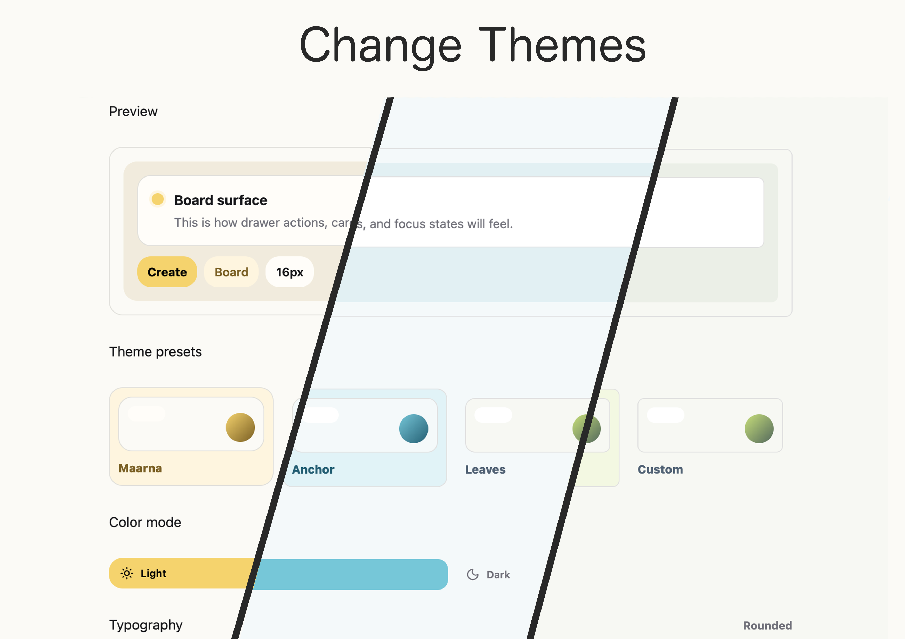
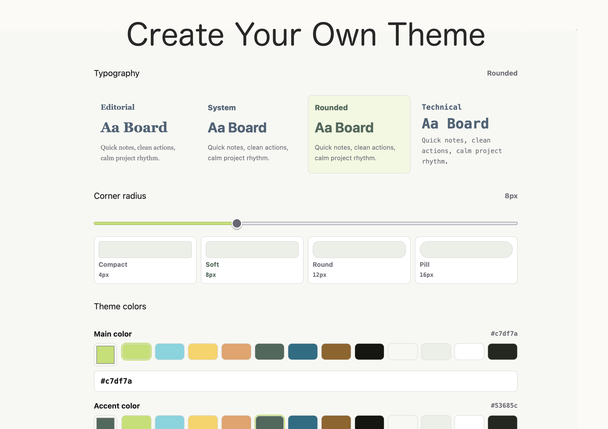

# Limestone

Limestone is a self-hosted kanban, calendar, and notes workspace for small teams that want their work in one calm place. It gives you project boards, scheduled work, team notes, account management, themes, and realtime updates without sending your data to a hosted SaaS product.

It is built for the kind of team that wants something simple enough to run on a VPS, but polished enough to use every day.

## App Tour

### Organize Work

Start with a focused kanban board for daily execution. Create cards, move work through planned, ongoing, and finished states, and keep each project easy to scan.



### Plan Across Time

Use the calendar when work needs a date, a time window, or a bigger planning view. Limestone includes month, week, and day layouts so the same work can be reviewed at different levels of detail.

<p>
  
  
</p>

<p>
  
</p>

### Keep Context Close

Write shared notes, keep project context beside the board, and manage user accounts from an admin-only workspace.

<p>
  
  
</p>

### Make It Feel Like Yours

Switch between light and dark modes, choose a preset theme, or create a custom look with your own colors, typography, and corner radius.

<p>
  
  
</p>

<p>
  
</p>

## What You Can Do

Limestone brings the daily work surfaces of a small team into one app:

- Plan projects with a focused kanban board.
- Move cards through planned, ongoing, and finished work.
- Schedule work on month, week, and day calendar views.
- Keep shared notes next to the work they support.
- Manage accounts from an admin-only workspace.
- Personalize the app with light mode, dark mode, themes, fonts, radius, and custom colors.
- Switch between English and Turkish.
- Keep sessions in sync with realtime updates.
- Store everything in a local SQLite database.

## Why Self-Host It

Limestone is for teams that want ownership and quiet infrastructure:

- Your data lives on your server.
- Deployment is a normal Docker Compose flow.
- SQLite keeps persistence simple.
- The app is easy to back up because the database lives in a Docker volume.
- There is no external project-management account to maintain.

## Good Fit

Limestone works well for:

- small teams;
- agency and studio project tracking;
- personal operations dashboards;
- internal work calendars;
- lightweight admin-managed collaboration;
- teams that want a private tool on their own VPS.

It is intentionally not trying to be a giant enterprise suite. The sweet spot is clear planning, shared context, and a pleasant daily workflow.

## Self-Hosting

Clone the repo, create an environment file, and start the container:

```bash
git clone https://github.com/Bl4ckbamba/Limestone-Kanban-Calendar.git
cd Limestone-Kanban-Calendar
cp release.env.example .env
```

Edit `.env` before first start:

- `SESSION_SECRET`: set a long random value.
- `ADMIN_PASSWORD`: set a strong first admin password with at least 10 characters.
- `TRUST_PROXY`: set to `1` only when the container is reachable exclusively through a trusted reverse proxy.

Then run:

```bash
docker compose --env-file .env up -d --build
```

Open `http://your-server:3000` unless you changed `LIMESTONE_PORT`.

## First Login

When the database is empty, Limestone creates the first admin account automatically.

Production startup requires `ADMIN_PASSWORD` before the first admin can be
created. The development default `admin` password is refused in production, so
set a real password in `.env` before starting the container.

## Configuration

| Variable | Default | Description |
| --- | --- | --- |
| `SESSION_SECRET` | none | Required in production. Use a long random value. |
| `SESSION_COOKIE_SECURE` | `auto` | Session cookie secure mode. Use `auto` behind trusted HTTPS proxies, `true` for HTTPS-only deployments, or `false` only for direct HTTP/local checks. |
| `ADMIN_USERNAME` | `admin` | Initial admin username when no admin exists. |
| `ADMIN_PASSWORD` | none | Required before first production startup. Must be set to a non-default value with at least 10 characters. |
| `LIMESTONE_PORT` | `3000` | Host port exposed by Docker Compose. |
| `TRUST_PROXY` | `false` | Express trust proxy setting. Use deliberately when behind a trusted reverse proxy, for example `1` for one proxy hop. |
| `LOGIN_BAN_ATTEMPT_LIMIT` | `15` | Failed login attempts allowed during the rolling window. |
| `LOGIN_BAN_WINDOW_MS` | `900000` | Rolling window for counting failed login attempts, in milliseconds. |
| `LOGIN_BAN_DURATION_MS` | `900000` | Length of an IP login ban, in milliseconds. |

SQLite data is stored in the named Docker volume `limestone-data`, mounted inside the container at `/data`.

## Updating

Pull the latest repo changes and rebuild:

```bash
git pull
docker compose --env-file .env up -d --build
```

The Docker volume is kept, so the SQLite database persists across rebuilds. Back up the `limestone-data` volume before major upgrades or VPS maintenance.

## Runtime Package

This repository is the deployable Limestone runtime package, not the full private development source tree. It includes:

- `dist/`: built frontend assets.
- `server/`: production Node/Express runtime.
- `bin/limestone`: packaged Limestone CLI binary when available.
- `Dockerfile` and `docker-compose.yml`: container runtime.
- `release-manifest.json`: version, source commit, build node version, and packaging timestamp.

More maintainer and operator details are available in `docs/wiki/index.md`.

## License And Attribution

Limestone is licensed under the Apache License, Version 2.0. See `LICENSE`.

Attribution and project notice information are in `NOTICE`.
